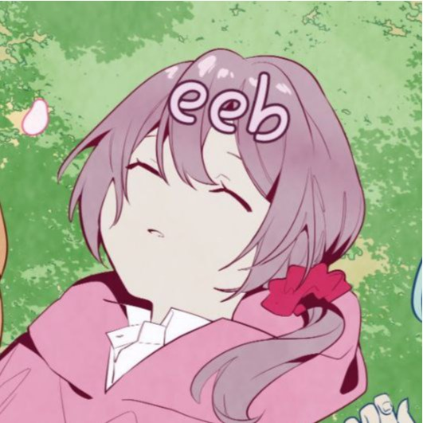

<h1 align=center>Player Skins</h1>

<h2><a href="./behwall/readme.md">Behwall</a></h2>
</img>

Skins: (727 haha im funny)

<h2><a href="./imagineBlaze/readme.md">ImagineBlaze</a></h2>
</img>

Skins: (727 haha im funny)

<h2><a href="./behwall/readme.md">Behwall</a></h2>
</img>

Skins: (727 haha im funny)

<h2><a href="./behwall/readme.md">Behwall</a></h2>
</img>

Skins: (727 haha im funny)

