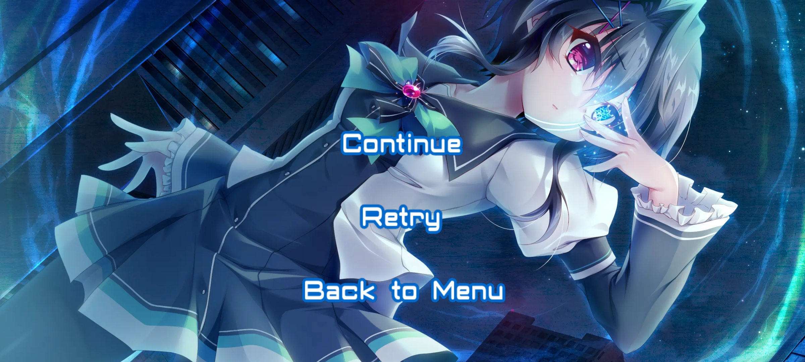

<h1 align="center">FernPoutington</h1>
<h2 align="center">Noa Yuuki</h2>

  
  
  
  

<h4 align="center">Mod Selection</h4>

<h5 align="center">Difficulty reduction</h5>

  

<h5 align="center">Difficulty increase</h5>

  
  
  

<h5 align="center">Automatization</h5>

  

<h5 align="center">Conversion</h5>

  
  

<h5 align="center">Fun</h5>

  
  

<h3 align="center">
  <a href="https://drive.google.com/uc?export=download&id=1iVgw9OQG0lo1U-Zt3R9j-wDpGkA_wof7">
    Download (17.4 MB)
  </a>
</h3>
